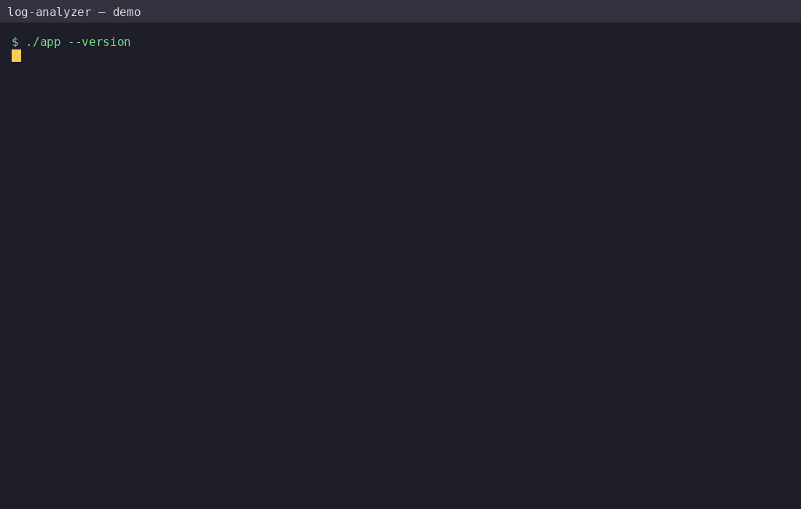
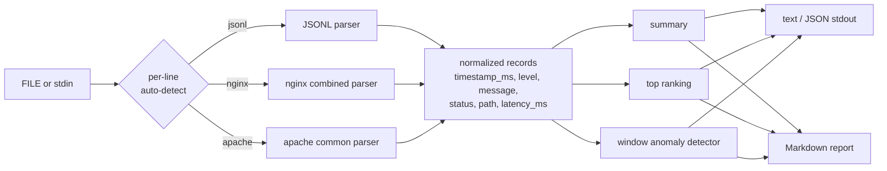

# Log Analyzer

One CLI that reads JSON-lines, nginx combined and apache common logs, normalizes
every line into a single record model, and prints a summary, rankings,
time-window anomaly detection and a Markdown report — streaming from a file or
from `stdin`, never crashing on a bad line.

<p align="center">
  
</p>

> The demo GIF is produced with [vhs](https://github.com/charmbracelet/vhs) from
> [`demo/demo.tape`](demo/demo.tape). Regenerate it with `vhs demo/demo.tape`.

## Install

There are no runtime dependencies — only a Python 3.11+ interpreter.

```bash
git clone <this-repo> && cd log-analyzer
./app --version
# log-analyzer 0.1.0
```

`./app` is a POSIX executable wrapper that dispatches to `src/log_analyzer.py`.

## Usage

```
./app <subcommand> [options] [FILE]
```

`FILE` is optional; when omitted (or given as `-`) input is read from `stdin`.
Flags may appear before or after `FILE`, and both `--format nginx` and
`--format=nginx` are accepted.

| flag | values | default | effect |
|---|---|---|---|
| `--format` | `auto`, `jsonl`, `nginx`, `apache` | `auto` | force a parser (with `auto`, detection is per line) |
| `--json` | — | off | compact JSON on `stdout` |
| `--strict` | — | off | any invalid line ⇒ exit `3` |
| `--quiet` | — | off | suppress warnings on `stderr` |
| `--help` | — | — | help and exit `0` |
| `--version` | — | — | print `log-analyzer 0.1.0` and exit `0` |

### `summary`

```console
$ ./app summary tests/fixtures/ac1.jsonl
total: 5
invalid_lines: 0
format: jsonl
levels:
  error	2
  info	3
statuses:
  200	3
  500	1
  503	1
top_paths:
  3	/a
  2	/b
latency_ms:
  count	5
  min	10.00
  max	50.00
  mean	30.00
  p50	30.00
  p95	50.00
  p99	50.00
```

`--json` emits one compact line:

```console
$ ./app summary --json tests/fixtures/ac1.jsonl
{"version":"0.1","command":"summary","input":{"source":"file","path":"tests/fixtures/ac1.jsonl","format":"jsonl","formats_seen":{"jsonl":5},"lines_total":5,"lines_valid":5,"lines_invalid":0},"total":5,"levels":{"info":3,"error":2},"statuses":{"200":3,"500":1,"503":1},"top_paths":[{"value":"/a","count":3},{"value":"/b","count":2}],"latency_ms":{"count":5,"min":10.0,"max":50.0,"mean":30.0,"p50":30.0,"p95":50.0,"p99":50.0}}
```

`--top N` (default `10`) limits `top_paths`. Percentiles are nearest-rank.

### `top`

```console
$ ./app top --by path tests/fixtures/ac1.jsonl
3	/a
2	/b

$ ./app top --by path --json tests/fixtures/ac3.log
{"version":"0.1","command":"top","by":"path","n":10,"input":{"source":"file","path":"tests/fixtures/ac3.log","format":"nginx","formats_seen":{"nginx":1},"lines_total":1,"lines_valid":1,"lines_invalid":0},"entries":[{"value":"/index.html","count":1}]}
```

`--by` is required and accepts `path`, `level`, `status`, `message`.
`--n N` (default `10`) limits the ranking. Ties break by ascending value.

### `anomalies`

```console
$ ./app anomalies --window 60s --k 2 tests/fixtures/ac8.jsonl
window_seconds: 60
metric: errors
k: 2.0
windows_total: 6
mean: 1.666667
stddev: 2.867442
anomalies:
  2026-01-01T00:05:00Z	2026-01-01T00:06:00Z	value=8	threshold=7.401550
```

`--window` accepts `<int><s|m|h>` (default `60s`), `--k` is the standard-deviation
factor (default `2.0`) and `--metric` is `errors` (default), `errors_rate` or
`count`.

### `report`

```console
$ ./app report --out report.md --now 2026-10-06T12:00:00Z tests/fixtures/ac1.jsonl
$ cat report.md
# Log Analyzer report
...
```

`--out` is required; `--out -` streams the full Markdown to `stdout` without
creating a file. `--now` fixes the generation timestamp for deterministic runs.
`--json` is rejected with `report`.

## Input formats

**JSON lines** — one JSON object per line. All fields are optional; at least one
known field must be present.

```json
{"timestamp":"2026-01-01T00:00:00Z","level":"info","status":200,"path":"/a","latency_ms":10}
```

`timestamp` accepts an ISO-8601 string with offset (no offset ⇒ UTC) or an
integer epoch in milliseconds. `status` accepts an integer or a numeric string.
`level` is lowercased.

**nginx combined**

```
127.0.0.1 - - [10/Oct/2000:13:55:36 -0700] "GET /index.html HTTP/1.0" 200 2326 "-" "curl/8.0"
```

**apache common**

```
10.0.0.1 - alice [10/Oct/2000:13:55:36 -0700] "POST /login?next=/home HTTP/1.1" 500 128
```

For both access formats the request line becomes `message`, the path is the
second token with the query string stripped, and `level` is derived from the
status (`>=500` ⇒ `error`, `400–499` ⇒ `warn`, `<400` ⇒ `info`). An optional
trailing latency value (in ms) after the user-agent/byte-count is recognized.

**Auto-detection** runs per line, in order: JSONL → nginx → apache. The
`input.format` field reports the dominant format (most valid lines, ties broken
`jsonl` > `nginx` > `apache`) and `input.formats_seen` counts every format that
appeared:

```console
$ ./app summary --json tests/fixtures/ac11.mixed
{"version":"0.1","command":"summary","input":{"source":"file","path":"tests/fixtures/ac11.mixed","format":"jsonl","formats_seen":{"jsonl":2,"nginx":1,"apache":1},"lines_total":4,"lines_valid":4,"lines_invalid":0},"total":4,"levels":{"info":2,"error":1,"warn":1},"statuses":{"200":2,"500":1,"404":1},"top_paths":[{"value":"/a","count":1},{"value":"/b","count":1},{"value":"/health","count":1},{"value":"/index.html","count":1}],"latency_ms":null}
```

## Anomaly detection

Records are bucketed into fixed, epoch-aligned windows of `W` milliseconds;
every window between the first and the last non-empty one is analyzed,
including empty ones (value `0`). For each window the metric is the number of
5xx responses (`errors`), the ratio `5xx / total` (`errors_rate`) or the total
record count (`count`).

Over the `N` window values `x_i` (`N = windows_total`):

```
μ = (Σ x_i) / N
σ = sqrt( Σ (x_i − μ)² / N )      # population standard deviation
threshold = μ + k · σ
```

A window is an anomaly only when `x_i > threshold` (strictly greater). When
`σ == 0` — including `N == 1` — there are never any anomalies, even with
`k = 0`. `μ`, `σ` and `threshold` are computed in double precision and rounded
to 6 decimals only when serialized.

## Exit codes

| code | condition |
|---|---|
| `0` | success (empty file, and invalid lines without `--strict`) |
| `1` | usage error: unknown subcommand/flag, invalid value, missing required flag, `--json` with `report` |
| `2` | I/O error: unreadable `FILE`, unwritable `--out` |
| `3` | no valid line parsed while the input has ≥ 1 non-empty line; or any invalid line with `--strict` |
| `4` | unexpected internal error |

An input of 0 bytes (or whitespace only) yields `total = 0` and exit `0`. Errors
go to `stderr`; data goes to `stdout`.

## Architecture



The implementation is a single standard-library module
([`src/log_analyzer.py`](src/log_analyzer.py)) wrapped by the `./app`
executable. The full contract lives in [`SPEC.md`](SPEC.md).

## How this was built

The specification ([`SPEC.md`](SPEC.md)) came first and was treated as the
contract: every flag, exit code, field and rounding rule in the code traces
back to a numbered requirement in it. The implementation was produced by an
autonomous AI agent running inside an internal harness, with no human editing of
the code. The black-box acceptance tests were written by a **separate,
independent AI agent** from the spec alone; they live outside this repository and
are executed by the harness against the `./app` executable. This is not a
human-written test suite.

The first implementation round had a real bug: the normalized record was seeded
from the *input* field names (`timestamp`) instead of the *internal* model
(`timestamp_ms`), so any record without a timestamp crashed `anomalies` and
`report` with a `KeyError`. The happy-path smoke checks hid it because every
fixture used there carried a timestamp; a black-box test feeding timestamp-less
records exposed it. The fix seeds records from the internal field list, and that
regression case is now covered by the suite.

## Testing

The black-box suite invokes `./app` in a subprocess (never importing internal
modules) and is table-driven, one file per subcommand:

```bash
make test    # python3 -m unittest discover -s tests/blackbox
make lint    # ruff (falls back to compileall if ruff is absent)
make smoke   # end-to-end check of the JSON happy path
```

Fixtures used by the tests live in [`tests/fixtures/`](tests/fixtures).

## License

[MIT](LICENSE) © 2026 Gabrielpl-dev
